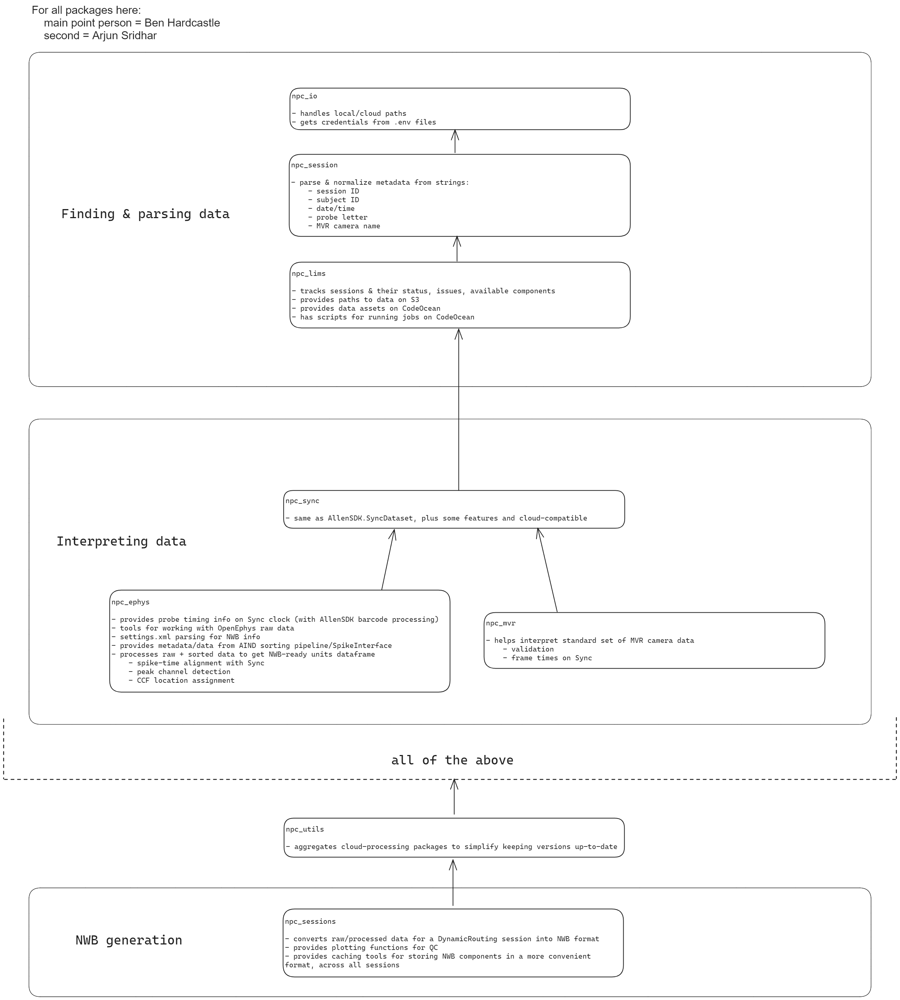

# npc_sessions
**n**euro**p**ixels **c**loud **sessions**
	
Tools for accessing data and metadata for behavior and epyhys sessions from the
Mindscope Neuropixels team - in the cloud.

[](https://pypi.org/project/npc-sessions/)
[](https://pypi.org/project/npc-sessions/)

[](https://app.codecov.io/github/AllenInstitute/npc_sessions)
[](https://github.com/alleninstitute/npc_sessions/actions/workflows/publish.yml)
[](https://github.com/alleninstitute/npc_sessions/issues)


## quickstart
Make a conda environment with python>=3.9 and simply pip install the npc_sessions package:

```bash
conda create -n npc_sessions python>=3.9
conda activate npc_sessions
pip install npc_sessions
```

```python
>>> from npc_sessions import DynamicRoutingSession, get_sessions;

# each object is used to get metadata and paths for a session:         
>>> session = DynamicRoutingSession('668755_2023-08-31')  
>>> session.is_ephys                                
True
>>> session.stim_paths[0].stem                      
'DynamicRouting1_668755_20230831_131418'
# data is processed on-demand to generate individual pynwb modules:
>>> session.subject                                 # doctest: +SKIP
  subject pynwb.file.Subject at 0x1999418231888
  Fields:
    age: P205D
    age__reference: birth
    date_of_birth: 2023-02-06 20:23:02-08:00
    genotype: wt/wt
    sex: M
    species: Mus musculus
    strain: C57BL6J(NP)
    subject_id: 668755

# a full NWBFile instance can also be generated with all currently-available data:
>>> session.nwb                                     # doctest: +SKIP
root pynwb.file.NWBFile at 0x...
Fields:
  acquisition: {
    lick spout <class 'ndx_events.events.Events'>
  }
  devices: {
    18005102491 <class 'pynwb.device.Device'>,
    18005114452 <class 'pynwb.device.Device'>,
    18005123131 <class 'pynwb.device.Device'>,
    18194810652 <class 'pynwb.device.Device'>,
    19192719021 <class 'pynwb.device.Device'>,
    19192719061 <class 'pynwb.device.Device'>
  }
   ...  

# loop over all currently-tracked sessions using the session-generator:
>>> all(s.session_start_time.year >= 2022 for s in get_sessions()) # doctest: +SKIP
True
>>> trials_dfs = {}
>>> for session in get_sessions():                  # doctest: +SKIP
...     trials_dfs[session.id] = session.trials[:]

```

## to develop with conda
To install with the intention of contributing to this package:

1) create a conda environment:
```bash
conda create -n npc_sessions python>=3.9
conda activate npc_sessions
```
2) clone npc_sessions from github:
```bash
git clone git@github.com:AllenInstitute/npc_sessions.git
```
3) pip install all dependencies:
```bash
cd npc_sessions
pip install -e .
```

# Hierarchy of required packages 


# Current NWB components

#### key data types

(the following all have a `description` field, as well as other type-specific attributes)

- `DynamicTable`: for general tabular data
  - e.g. `nwb.units`
  - each column in the table is stored as a vector, which can be accessed
    individually (fast) 
  - can be accessed as a pandas dataframe with `nwb.units[:]`, but requires
    reading all data in all columns (slow)
  - as well as individual values, cells in the table can contain multidimensional
    arrays. These are represented differently depending on location:
    - in the pandas dataframe, these are represented as one would expect: 
      - `nwb.units[:].spike_times.iloc[0]` is a 1-D array
      - `nwb.units[:].waveform_mean.iloc[0]` is a 2-D array (time x channels)
    - in the non-dataframe memory representation, there are *sometimes* two
      components, where the `*_index` is the one that should be used:
      - `nwb.units.spike_times` is a 1-D array of all spike times for all units,
        in chronological order (float)
      - `nwb.units.spike_times_index` is a list (len = num units) of
        arrays (len = num spikes for each unit)
    - on disk, these columns separated columns are different again, for example:
      - `/nwb/units/spike_times` is a 1-D array of all spike times for all units,
        in chronological order (float)
      - `/nwb/units/spike_times_index` is a 1-D array of values corresponding to
        the end of each unit's times in `/nwb/units/spike_times`:
        - the first unit's spike times are in `spike_times[: spike_times_index[0]]` 
        - the second unit's are in `spike_times[spike_times_index[0]: spike_times_index[1]]`

- `TimeIntervals`: for tabular data where each row is an interval of time
  - a subclass of `DynamicTable` which must have a `start_time` and `stop_time` column, plus any other user-defined columns

- `TimeSeries`: for general array data
  - has an array of `data` (1-D or N-D, with time as first dimension)
  - has `units` as a string
  - has either:
    - `timestamps` (same length as `data`)
    - `starting_time` and `rate` (assumed to be constant)

- `ElectricalSeries`: for ephys array data
  - a subclass of `TimeSeries` with units fixed as volts

- `Events`: an NWB extension for discrete event times
  - like the `TimeSeries` class, but only has `timestamps`, without values for `data` (think: lick times)

---
- *session metadata* (multiple attributes)
- subject (multiple attributes)
- devices: `DynamicTable`	
  - physical probes (model, serial number)
  - currently only neuropixels probes
- electrode_groups: `DynamicTable`
  - represents the group of channels on one probe inserted in the brain
  - has session-specific info, like position relative to other probes or stereotactic coords
- electrodes: `DynamicTable`
  - individual channels on a probe
  - has CCF coords
- units: `DynamicTable`
  - metrics, links to `electrodes` via `peak_channel`

- epochs: `TimeIntervals` 		
  - start/stop time of each stim block
  - has a list of tags (includes `TaskControl` subclass name)
- intervals: `Mapping[str, TimeIntervals]`
  - 1x table per stim epoch with trials
  - behavior performance table (each block an interval)
- trials: `TimeIntervals` 
  - same as `intervals[DynamicRouting1]`
- invalid_times: `TimeIntervals` 

- **acquisition**: `Mapping[str, Any]` *raw data*
  - if is_ephys:
    - raw AP: `Mapping[str, ElectricalSeries]`
    - raw LFP: `Mapping[str, ElectricalSeries]`
  - if is_sync:
    - lick_sensor_rising_edges: `Events`    
    - lick_sensor_falling_edges: `Events`   
  - if is_task:
    - rewards: `Events`
  - if is_video:   	
    - video frame times: 1x `Events` per camera
	
- **processing**: `Mapping[str, Any]` *processed/filtered data*
  - behavior: `Mapping[str, Any]`
      - licks: `Events`		
        - from sync or stim file
      - running_speed: `TimeSeries` 		
        - from stim file, enhanced with sync info if available
  - ecephys: `Mapping[str, Any]`

- **analysis**: `Mapping[str, Any]` *derived data, results*
  - if is_ephys:
    - all_spike_histograms: 1x `TimeSeries` per probe
    - drift_maps: `ImageSeries`
  - if is_task:
    - performance: `TimeIntervals`

Todo:
- filtered LFP
- stimulus templates (vis, aud, opto)
- OptogeneticStimulusSite
- analysis -> RFMaps
- per-unit response metric for each stim modality
